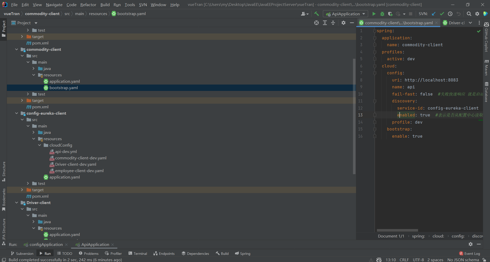
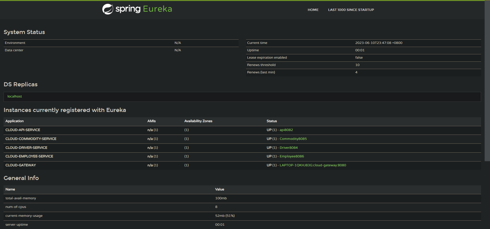

## 微服务

将项目分解为四部分，分别为api，负责登录注册校验以及用户权限管理；commodity-client，负责商品管理；Driver-client，负责物流运输模块；employee-client，负责公司工作人员管理以及账目管理模块。

加入依赖：

```xml
        <dependency>
            <groupId>org.springframework.cloud</groupId>
            <artifactId>spring-cloud-starter-netflix-eureka-client</artifactId>
        </dependency>
        <dependency>
          <groupId>org.springframework.boot</groupId>
          <artifactId>spring-boot-starter-actuator</artifactId>
        </dependency>
```

配置Eureka客户端：

```yaml
eureka:
  client:
    register-with-eureka: true #表明将自己注册进EurekaServer
    fetch-registry: true
    service-url:
      defaultZone: http://localhost:8081/eureka/
  instance:
    instance-id: api8082 #注册的服务名称
```

springboot启动类配置Eureka：

```java
package com.example.api;

import org.springframework.boot.SpringApplication;
import org.springframework.boot.autoconfigure.SpringBootApplication;
import org.springframework.cloud.netflix.eureka.EnableEurekaClient;

@SpringBootApplication
@EnableEurekaClient

public class ApiApplication {
    public static void main(String[] args) {
        SpringApplication.run(ApiApplication.class, args);
    }

}
```


## 服务注册中心-Eureka

加入依赖：

```xml
        <dependency>
            <groupId>org.springframework.cloud</groupId>
            <artifactId>spring-cloud-starter-netflix-eureka-server</artifactId>
        </dependency>
        <dependency>
            <groupId>org.springframework.boot</groupId>
            <artifactId>spring-boot-starter-web</artifactId>
        </dependency>
        <dependency>
            <groupId>org.springframework.boot</groupId>
            <artifactId>spring-boot-starter-actuator</artifactId>
        </dependency>
```

Eureka注册中心配置：

```yaml
eureka:
  instance:
    hostname: eureka8081.com #Eureka服务器的实例名称
  client:
    register-with-eureka: false #不向注册中心注册自己
    fetch-registry: false #不需要去检索服务
    service-url:
      #设置与EurekaServer交互的地址查询服务和注册服务都需要依赖这个地址
      defaultZone: http://localhost:8081/eureka/
```

注册中心启动类：

```java
package com.example.api;

import org.springframework.boot.SpringApplication;
import org.springframework.boot.autoconfigure.SpringBootApplication;
import org.springframework.cloud.netflix.eureka.server.EnableEurekaServer;

@SpringBootApplication
@EnableEurekaServer

public class ApiApplication {

    public static void main(String[] args) {
        SpringApplication.run(ApiApplication.class, args);
    }

}

```


## Gateway

使用gateway注册在8080端口，监听8082,8084,8085,8086四个端口的微服务，使得前端能通过8080访问四个微服务端口。

注入依赖：

```xml
        <dependency>
            <groupId>org.springframework.cloud</groupId>
            <artifactId>spring-cloud-starter-gateway</artifactId>
        </dependency>
        <!--使用Eureka服务注册中心-->
        <dependency>
            <groupId>org.springframework.cloud</groupId>
            <artifactId>spring-cloud-starter-netflix-eureka-client</artifactId>
        </dependency>
```

编写配置类，允许端口跨域：

```java
package com.example.api.config;

import org.springframework.context.annotation.Bean;
import org.springframework.context.annotation.Configuration;
import org.springframework.web.cors.CorsConfiguration;
import org.springframework.web.cors.reactive.CorsWebFilter;
import org.springframework.web.cors.reactive.UrlBasedCorsConfigurationSource;
import org.springframework.web.server.WebFilter;
import org.springframework.web.util.pattern.PathPatternParser;

import java.util.Arrays;


/**
 * 跨域配置
 *
 * @author zc
 */
@Configuration
public class CorsConfig {

    @Bean
    public WebFilter corsFilter() {
        CorsConfiguration config = new CorsConfiguration();
        config.addAllowedMethod("*");
        config.addAllowedHeader("*");
        // 允许携带cookie的地址进行跨域
        config.setAllowCredentials(true);

        // 明确列出允许使用凭证的原始来源
        config.setAllowedOrigins(Arrays.asList("http://localhost:8083", "http://localhost:8082", "http://localhost:8084"
                , "http://localhost:8085", "http://localhost:8086"));
        // 或者使用allowedOriginPatterns
        // config.setAllowedOriginPatterns(Arrays.asList("http://example*.com"));

        UrlBasedCorsConfigurationSource source = new UrlBasedCorsConfigurationSource(new PathPatternParser());
        source.registerCorsConfiguration("/**", config);

        return new CorsWebFilter(source);
    }
}
```

配置路由：

```yaml
server:
  port: 8080
spring:
  mail:
    host: smtp.163.com
    protocol: smtp
    default-encoding: UTF-8
    #发件人
    username: gaoyuanming_1@163.com
    #授权码
    password: a123456
  datasource:
    driver-class-name: com.mysql.cj.jdbc.Driver
    url: jdbc:mysql://localhost:3306/bjpowernode?characterEncoding=utf8&serverTimezone=UTC
    username: root
    password: lion12345
  jpa:
    hibernate:
      ddl-auto: update
    open-in-view: false
  application:
    name: cloud-gateway
  cloud:
    #配置路由
    gateway:
      default-filters:
        - DedupeResponseHeader=Access-Control-Allow-Origin Access-Control-Allow-Credentials Vary, RETAIN_UNIQUE
      globalcors:
        add-to-simple-url-handler-mapping: true
        cors-configurations:
          '[/**]':
            allowedOrigins:
              - "http://localhost:8083"
              - "http://localhost:8082"
              - "http://localhost:8084"
              - "http://localhost:8085"
              - "http://localhost:8086"
            allowedMethods:
              - "GET"
              - "POST"
              - "DELETE"
              - "PUT"
              - "OPTIONS"
            allowedHeaders: "*"
            allowCredentials: true
            maxAge: 360000
      #这里可以配置多个路由
      routes:
        - id: payment_distribution #路由的id
          uri: http://localhost:8084 #匹配后提供服务的路由地址
          predicates:
            - Path=/api/distribution/**, /api/driver/**, /api/vehicle/**
        - id: payment_commodity #路由的id
          uri: http://localhost:8085 #匹配后提供服务的路由地址
          predicates:
            - Path=/api/commodity/**, /api/inventory/**
        - id: payment_employee #路由的id
          uri: http://localhost:8086 #匹配后提供服务的路由地址
          predicates:
            - Path=/api/employee/**, /api/sale/**, /api/warehouse/**
        - id: payment_routh #路由的id
          uri: http://localhost:8082 #匹配后提供服务的路由地址
          predicates:
            - Path=/** #断言 路径相匹配的进行路由


eureka:
  instance:
    hostname: cloud-gateway
  client:
    register-with-eureka: true #表明将自己注册进EurekaServer
    fetch-registry: true
    service-url:
      defaultZone: http://localhost:8081/eureka/
```

## SpringCloud Config

注入依赖：

```xml
    <dependency>
        <groupId>org.springframework.boot</groupId>
        <artifactId>spring-boot-starter-web</artifactId>
    </dependency>
    <dependency>
        <groupId>org.springframework.cloud</groupId>
        <artifactId>spring-cloud-config-server</artifactId>
    </dependency>
    <dependency>
        <groupId>org.springframework.cloud</groupId>
        <artifactId>spring-cloud-starter-netflix-eureka-client</artifactId>
    </dependency>
```

配置yml，使用本地作为配置注册中心：

```yml
server:
  port: 8083
spring:
  application:
    name: config-eureka-client
  http:
    converters:
      preferred-json-mapper: gson
  cloud:
    config:
      server:
        native:
          search-locations: classpath:/cloudConfig/
        bootstrap: true
  profiles:
    active: native
eureka:
  client:
    register-with-eureka: true #表明将自己注册进EurekaServer
    fetch-registry: true
    service-url:
      defaultZone: http://localhost:8081/eureka/
  instance:
    instance-id: configserver8083 #注册的服务名称
    preferIpAddress: true
```

在config client里编写配置：

```yml
spring:
  application:
    name: commodity-client
  profiles:
    active: dev
  cloud:
    config:
      uri: http://localhost:8083
      name: api
      fail-fast: false  #失败快速响应 就是启动的时候，如果启动失败能够快速响应，而不是日志都打印一大堆了，才报错
      discovery:
        service-id: config-eureka-client  #这里是config服务端注册到eureka的服务名称
        enabled: true  #表示是否从配置中心读取文件
      profile: dev
    bootstrap:
      enable: true
```

调整项目结构：



# 运行截图



# 其他内容

非本次作业内容见其他设计报告。
